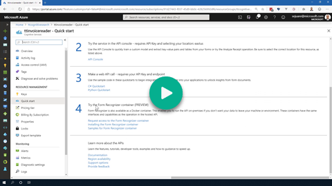
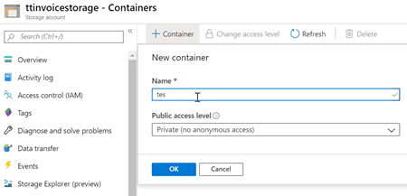
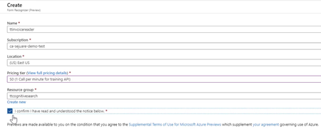
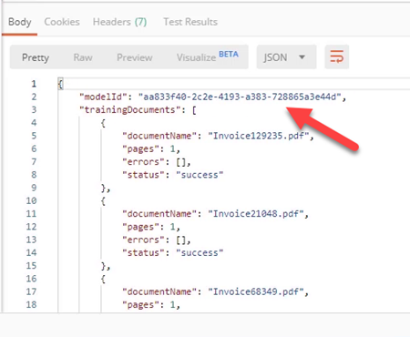
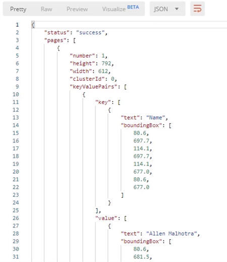

# Task 2 - Using Form Recognizer

[](https://globaleventcdn.blob.core.windows.net/assets/aiml/aiml10/videos/Demo2.mp4 "Demo 2")

## Summary
In this exercise you will learn how to use the Form Recognizer service. It is assumed that a storage account has been created (as described in the [first task](workshop-task1.md).)


## What you need
- [Invoice Training Set](https://globaleventcdn.blob.core.windows.net/assets/aiml/aiml10/data/training.zip)

- [Postman](https://www.getpostman.com/) is used to send requests to the Form Recognizer service REST API. Refer to this [short primer](postman.md) to learn more.

- Postman Form Recognizer requests [collection](../src/Collections/Form_Recognizer.postman_collection.json).

## Azure Resources
The only resource we work with in this demonstration is the Form Recognizer service.


| Name                       | Type                            | Purpose                    |
| -------------------------- | ------------------------------- | ------------------------- |
| **ttinvoicereader**       | Form Recognizer Service         | This service is now in public preview and can be created through the Azure portal  |


# What to do

There are three main steps:
1. Upload training data to the storage account
2. Create Form Recognizer service
3. Train and Use Form Recognizer service

# Upload Training Data


1. Create another container in your Azure Storage account called `train` just like we did in the previous task.

[](https://docs.microsoft.com/en-us/azure/storage/blobs/storage-quickstart-blobs-portal?WT.mc_id=msignitethetour2019-github-aiml10 "Create Container")

2. Download and unzip [invoice training set](https://globaleventcdn.blob.core.windows.net/assets/aiml/aiml10/data/training.zip).

3. Upload unzipped [invoice training set](https://globaleventcdn.blob.core.windows.net/assets/aiml/aiml10/data/training.zip) to the `train` container. This can be done directly using the [portal](https://docs.microsoft.com/en-us/azure/storage/blobs/storage-quickstart-blobs-portal?WT.mc_id=msignitethetour2019-github-aiml10#upload-a-block-blob) or by using the [Azure Storage Explorer](https://docs.microsoft.com/en-us/azure/vs-azure-tools-storage-explorer-blobs?WT.mc_id=msignitethetour2019-github-aiml10) *(Both ways were described in [Task 1](workshop-task1.md) - please review if necessary)*

# Create Form Recognizer service

In the Azure Portal, Create a new resource and search for 'Form Recognizer' and select 'Form Recognizer (preview)

Click create and complete details with a relevant name for the service and in the same location as all your other resources. 

*Make sure the pricing tier is S0*

[](https://docs.microsoft.com/en-us/azure/cognitive-services/form-recognizer/overview?WT.mc_id=msignitethetour2019-github-aiml10#request-access "Form Recognizer")

Once created navigate to the resource and take a note of the endpoint and key displayed - you will need these shortly.

# Train the Form Recognizer Service

This section uses Postman and assumes you know about loading collections, handling variables, and setting pre-request scripts. To learn how to do these specific things we have included some [instructions](postman.md).

The table below lists the variables set during this section of the exercise:

| Name                       | Type                            | Purpose                    |
| -------------------------- | ------------------------------- | ------------------------- |
| `Ocp-Apim-Subscription-Key`       | Authorization         | Key for getting access to Form Recognizer service  |
| `endpoint`       | Variable         | Specifies the Form Recognizer endpoint  |
| `modelId`       | Variable         | Current Form Recognizer model (this is set in step 5)  |

1. Open Postman and import the [Form Recognizer collection](src/Collections/Form_Recognizer.postman_collection.json) into Postman. If unsure of how to achieve this refer to [instructions here](../postman.md)

2. Set the `Ocp-Apim-Subscription-Key` authorization header as well as the `endpoint` variable to the Form Recognizer service.

* Select your loaded collection in postman call Forms Recognizer
* Select edit from the 3 little dots
* Select the Authorisation tab and enter your forms recognizer key into the Value box
* Select the Variables tab and enter your forms recognizer endpoint into initial and current value boxes

3. Open the `TrainModel` Request and change the Pre-request script to set the `storageAccount` variable to your storage account name and the `SASValue` to the appropriate Secure Access Signature to the `train` container. To learn how to get a Secure Access Signature, refer to our [brief explanation](sas.md).

```javascript
pm.environment.set('storageAccount', '<YOUR STORAGE ACCOUNT>')
pm.environment.set('container', 'train')
pm.environment.set('SASValue', '<SAS>')
```

4. Hit Send on the Request. Your response should look something like this:



5. Enter the setting of your collection again, select the Variables tab and set the `modelId` variable for the collection to the returned `modelId` from your request to the service.

#### What happened here? 

* We took 5 invoices and used them to send to the Form Recognizer service to train our model. 
* The service then returned a Model ID 
* The model ID is for a model that is specifically trained on our documents
* We can now use this model to recognize new documents sent to the service.


# Use the Form Recognizer Service

1. Open the `AnalyzeForm` request. In the **Body** section click on the `Select Files` button to choose an invoice downloaded previously (from your test container as this is testing data). After sending the request you should get something similar to:



# Next Task
Learn how to create custom Invoice Reader Skill with Azure Functions by continuing on to [Task 3 - Creating a Custom Invoice Reader Skill](workshop-task3.md)
