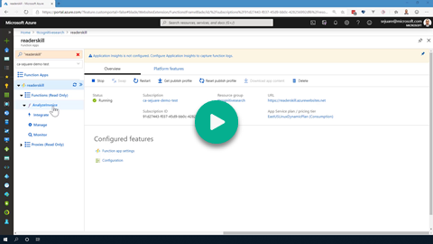
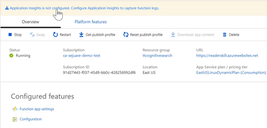

# Task 3 - Creating a Custom Invoice Reader Skill

[](https://globaleventcdn.blob.core.windows.net/assets/aiml/aiml10/videos/Demo3.mp4 "Demo 3")

## Summary
In this exercise we create an Azure Cognitive Search Skill (in the form of an Azure Function) that takes data from Azure Cognitive Search and returns a structured json document representing the contents of the pdf Invoice. To get a more in depth treatment of creating an Azure Function please refer to the [docs](https://docs.microsoft.com/en-us/azure/azure-functions/functions-create-first-azure-function-azure-cli?WT.mc_id=msignitethetour2019-github-aiml10). It is assumed that a storage account has been created (as described in the [first task](workshop-task1.md) as well as the Form Recognizer service created in the [second task](workshop-task2.md))


# What you need
- [Invoice Test Set](https://globaleventcdn.blob.core.windows.net/assets/aiml/aiml10/data/test.zip) (used to test the Azure Function)


- [Postman](https://www.getpostman.com/) is used to send requests to the Form Recognizer service REST API. Refer to this [short primer](../postman.md) to learn more.

- Postman Reader Skill Request [collection](../src/Collections/Reader_Skill.postman_collection.json).

- [Azure Functions Core Tools](https://docs.microsoft.com/en-us/azure/azure-functions/functions-run-local?WT.mc_id=msignitethetour2019-github-aiml10#v2)

## Azure Resources
The table below describes the resources created throughout this exercise.

| Name                       | Type                            | Purpose                    |
| -------------------------- | ------------------------------- | ------------------------- |
| **readerskillstorage**   | Storage Account              | Storage used for Azure Function |
| **readerskill**          | Function App                 | Cognitive Skill App |
| **readerskill**          | App Insights                   | Adds insights to Function App |
| **EastUS2LinuxDynamicPlan** | App Service Plan                   | Consumption based plan for running Function App (this is created implicitly) |

# What to do

There are three main steps:
1. Run the `InvoiceReaderSkill` Azure Function locally
2. Create resources to support the `InvoiceReaderSkill` Azure Function
3. Run the `InvoiceReaderSkill` on Azure

# Run the Azure Function Locally

1. Download the [InvoiceReaderSkill](../src/InvoiceReaderSkill) code found in this repo and open in [Visual Studio Code](https://code.visualstudio.com/) (make sure the [Azure Tools](https://marketplace.visualstudio.com/items?itemName=ms-vscode.vscode-node-azure-pack) are installed).

2. Add a `local.settings.json` file to the InvoiceReaderSkill folder with the following contents:

```json
{
  "IsEncrypted": false,
  "Values": {
    "FUNCTIONS_WORKER_RUNTIME": "python",
    "AzureWebJobsStorage": "{AzureWebJobsStorage}",
    "FormsRecognizerEndpoint": "<YOUR_FORMS_ENDPOINT>.cognitiveservices.azure.com",
    "FormsRecognizerKey": "<YOUR_FORMS_KEY>",
    "ModelId": "<YOUR_TRAINED_MODEL_ID>"
  }
}
```
3. Run the `func host start` command in the terminal to start the function.

4. Import the Postman Reader Skill Request [collection](../src/Collections/Reader_Skill.postman_collection.json) to Postman

5. Open the `Local Forms Skills` Request and change the Pre-request script to set the `storageAccount` variable to your storage account (in the video the variable is `ttinvoicestorage`) and the `SASValue` to the appropriate Secure Access Signature to the `test` container. To learn how to get a Secure Access Signature, refer to our [brief explanation](../sas.md).

```javascript
pm.environment.set('storageAccount', '<YOUR STORAGE ACCOUNT>')
pm.environment.set('container', 'test')
pm.environment.set('SASValue', '<SAS>')
```

6. Verify that the `POST` uri matches the one for the Azure Function (in our running of it we use `http://localhost:7071/api/AnalyzeInvoice`) and click on Send. You should get a response similar to that below:


# Create Azure Function Resources

It is assumed that the following commands are run in the same directory as the actual Function and you have logged into the Azure CLI using ```az login```

Or use the Azure Cloud Shell in the Azure Portal to run the two create functions and then head back to VS Code to run the publish function code. 

1. Run the following Azure CLI Commands to create the appropriate resources and publish the function:

Create Function Storage

```
az storage account create --name {FUNCTION_STORAGE} --location {LOCATION} --resource-group {YOUR_RG} --sku Standard_LRS
```

Create Function App
```
az functionapp create --resource-group {YOUR_RG} --consumption-plan-location {LOCATION} --name {FUNCTION_NAME} --storage-account {FUNCTION_STORAGE} --runtime python --os-type linux
```
Publish Function
```
func azure functionapp publish {FUNCTION_NAME} --build remote
```

2. Use Visual Studio Code to sync the local settings to the Azure Function by selecting the Azure button, navigating to the newly created function, right clicking on `Application Settings` and selecting `Upload Local Settings` 

> **(NOTE: Do not overwrite the existing variables).**


3. Browse to the newly created Function App in the portal to add Application Insights to the service.



# Run the Azure Function in the Cloud

1. Open the `Cloud Forms Skills` Request and change the Pre-request script to set the `storageAccount` variable to your storage account (in the video the variable is `ttinvoicestorage`) and the `SASValue` to the appropriate Secure Access Signature to the `test` container. To learn how to get a Secure Access Signature, refer to our [brief explanation](../sas.md).

```javascript
pm.environment.set('storageAccount', '<YOUR STORAGE ACCOUNT>')
pm.environment.set('container', 'test')
pm.environment.set('SASValue', '<SAS>')
```

2. Verify that the `POST` uri matches the one for the Azure Function (should look something like `https://<YOUR_ENDPOINT>.azurewebsites.net/api/AnalyzeInvoice`) and click on Send. You should get a response similar to that below:


# Next Task
Learn how to tie everything together and finally build the end to end solution by continuing on to [Task 4 - Tying it all together](workshop-task4.md)
